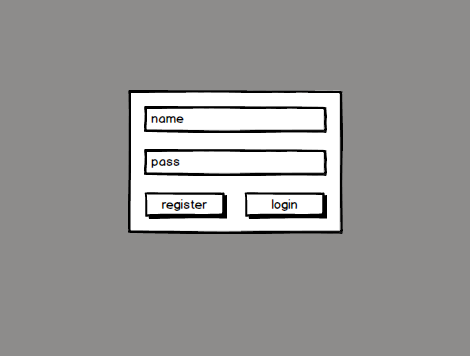
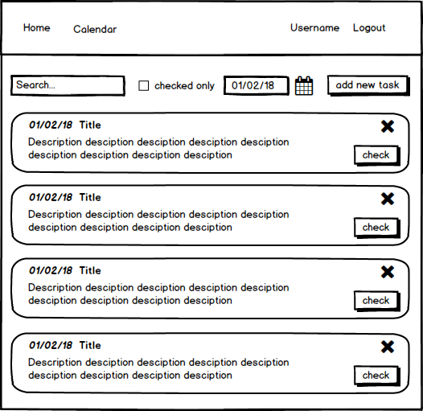
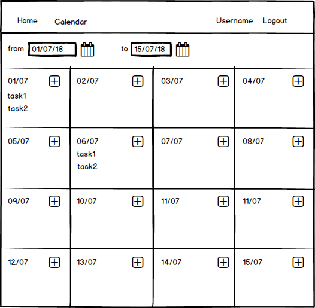
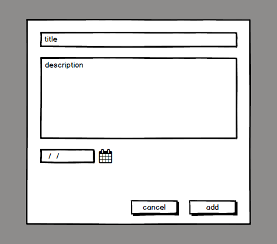

# Курсовой проект 

(_вариант 2_)

Сделать приложение TODO. 

В качестве хранилища использовать [firebase](https://firebase.google.com/)

### Окно логина:

### Главная:

### Календарь:

### Диалог добавления задачи:

